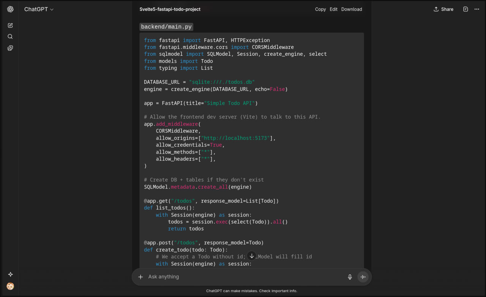

# Practice-ai

Simple ToDo List app using **FastAPI** backend and **Svelte5 + Tailwind** frontend.

## Backend

```sh
cd backend
uv install
uv run uvicorn main:app --reload
```

Runs at: `http://127.0.0.1:8000`

Available routes:
- `GET /todos` - get all todos
- `POST /todos` - create new todo
- `PATCH /todos/{todo_id}` - update todo by id
- `DELETE /todos/{todo_id}` - delete todo by id

## Frontend

```sh
cd frontend
bun install
bun run dev
```

Runs at: `http://127.0.0.1:5173`

## My input

Backend FastAPI stayed mostly the same

Frontend Svelte:
- Added TypeScript interface and type checking
- Unified naming (todo.completed -> todo.done)
- Removed cringe emoji
- Fixed Svelte4 syntax to Svelte5 syntax(use of rune `$state()`, and `onclick` instead of `on:click`)

README.md is written by me

## ChatGPT

[ChatGPT Share](https://chatgpt.com/share/68cc528e-1fd4-8003-9192-40569a1634d8)

The frontend part of the project is shown in the shared chat
The backend for this project was taken from the first message version, but ChatGPT only allows sharing a single chat state; backend snippet is attached as an image.



